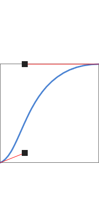
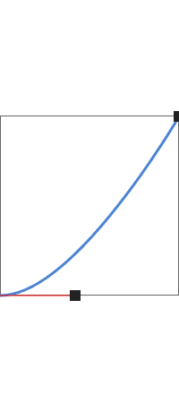
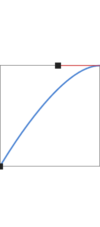
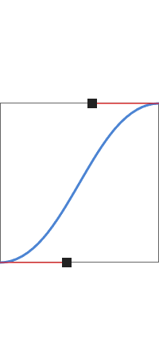

# @keyframes

- `@keyframes` 쿼리는 CSS에서 애니메이션을 작성하기 위해 사용하는 쿼리로, `from`부터 `to`까지 혹은 `0%`부터 `100%`까지, 애니메이션의 한 사[XHR2.css](..%2F..%2FJS%2F%BD%C7%BD%C0%2FXHR2.css)이클에 대한 선택자를 담는다.

# animation-name

- `animation-name` 속성은 `@keyframes` 쿼리에서 작성한 이름을 값으로 사용하여 선택자에 의해 선택된 요소에 애니메이션을 부여하기 위해 사용하는 속성이다.
- 값
  - `none`: 애니메이션이 없음
  - `[@keyframes 쿼리에 의해 정의된 이름]`

# animation-delay

- `animation-delay` 속성은 애니메이션이 시작되기 전 지연시킬 시간을 지정하기 위해 사용한다.
- 값
  - `[시간]` 

# animation-duration

- `animation-duration` 속성은 한 사이클이 완성되는 시간을 지정하기 위해 사용하는 속성이다.
- 값
    - `[시간]`

# animation-iteration-count

- `animation-iteration-count` 속성은 애니메이션 반복 횟수를 지정하기 위해 사용하는 속성이다.
- 값
  - `[숫자]`
  - `infinite`: 무한히 반복한다.

# animation-play-state

- `animation-play-state` 속성은 애니메이션 재생 상태를 지정하기 위해 사용한다.
- 값
  - `running`: 재생중.
  - `paused`: 일시 정지중.

# animation-timing-function

- `animation-timing-function` 속성은 애니메이션 지속 시간이 흐름에 따른 완료율에 대한 함수를 지정하기 위한 속성이다.
- 값
  - `ease`: 기본값. 
  - `ease-in` 
  - `ease-out` 
  - `ease-in-out` 
  - `linear`: 선형. 시간의 흐름에 따른 변화 완료율이 정비례한다.
  - 베지어 곡선 함수(`cubic-bezier(...)`): https://matthewlein.com/tools/ceaser

 
 
 
 
 
 
 
 
 
 