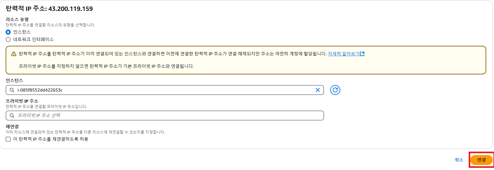
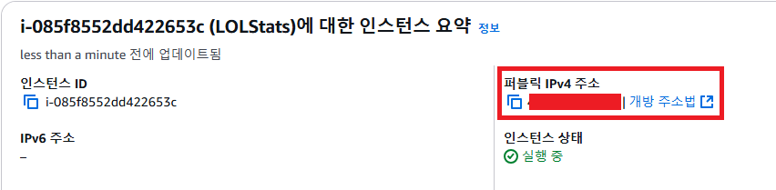
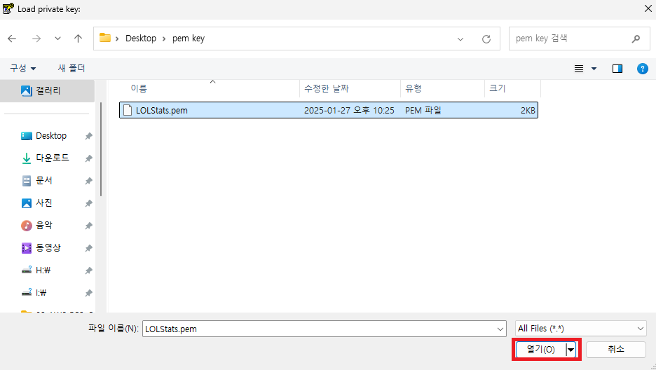
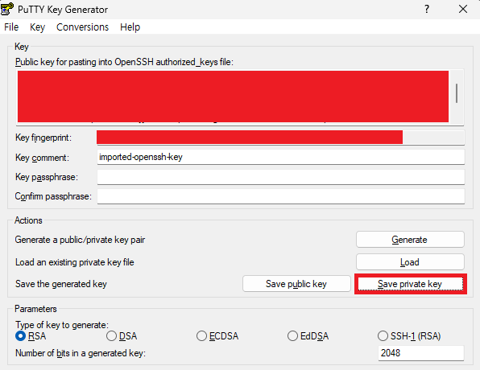
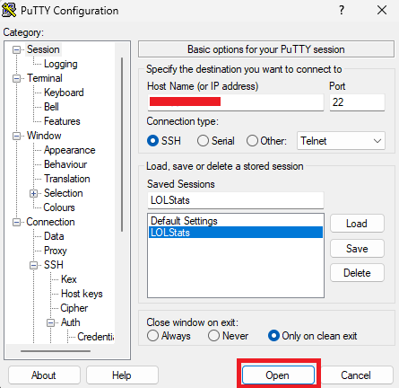
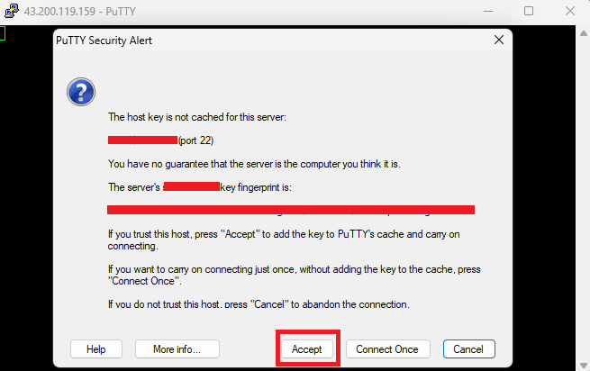

# EC2 인스턴스 설정 및 연결

## 1. 탄력적 IP

연결할 IP 체크 - 탄력적 IP 주소 연결
 

해당 인스턴스 선택 후, 퍼블릭 IPv4 주소가 탄력적 IP 주소로 변경되었는지 확인
 

## 2. 보안 그룹

규칙 추가 후, 규칙 저장
 

## 3. putty를 이용한 ec2 서버 연결
putty가 다운로드 되어있다는 가정하에, 과정을 정리하였습니다.

 

생성된 파일 확인
 

Connection - SSH - Auth - Credentials 클릭 후, Private key file for authentication 옆 Browse를 클릭하여 생성한 ppk 파일 등록
 

Session 클릭 후, EC2 인스턴스의 퍼블릭 IPv4 주소를 Host Name에 입력
 

Session 이름 입력 후, Save 클릭

login as에 `ec2-user` 입력 후, 아래와 같이 정상적으로 연결이 되는지 확인
 
