# EC2 서버 설정

## 1. Timezone 설정
```
sudo rm /etc/localtime
sudo ln -s /usr/share/zoneinfo/Asia/Seoul/etc/localtime
```

## 2. SWAP 설정
```
# 스왑 파일 생성
sudo dd if=/dev/zero of=/swapfile bs=128M count=16

# 스왑 파일에 대한 읽기 쓰기 권한 업데이트
sudo chmod 600 /swapfile

# Linux 스왑 영역 설정
sudo mkswap /swapfile

# 스왑 공간에 스왑 파일을 추가하여 스왑 파일을 즉시 사용할 수 있도록 설정
sudo swapon /swapfile

# 절차가 성공했는지 확인
sudo swapon -s

# /etc/fstab 파일 열기
sudo vi /etc/fstab

# 파일 가장 마지막에 다음을 추가하고 :wq로 저장하고 종료
/swapfile swap swap defaults 0 0

# free 명령어로 메모리 확인
free
```


## 3. 자바 설치
```
sudo yum install -y java-21
```

## 4. git 설치
```
sudo yum install -y git
```

## 5. yum 저장소 등록 및 import
```
sudo wget -O /etc/yum.repos.d/jenkins.repo https://pkg.jenkins.io/redhat-stable/jenkins.repo
sudo rpm --import https://pkg.jenkins.io/redhat-stable/jenkins.io.key

# 만약 위 명령이 오류가 발생하면
sudo rpm --import https://pkg.jenkins.io/redhat-stable/jenkins.io-2023.key
```

## 6. jenkins 설치 및 포트 변경
```
# jenkins 설치
sudo yum install -y jenkins

# jenkins 실행
sudo systemctl enable jenkins // 젠킨스 서비스 활성화
sudo systemctl start jenkins  // 젠킨스 서비스 실행
sudo systemctl status jenkins // 젠킨스 상태 확인
```

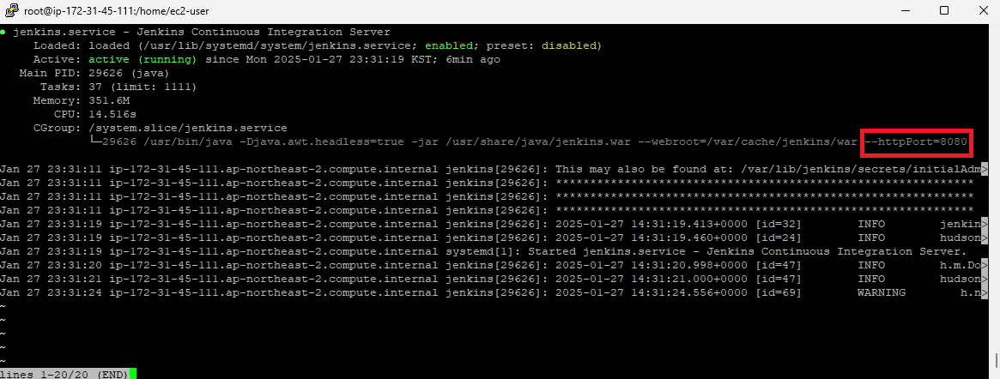

현재 8080 포트로 되어있는데, 본인이 EC2 인스턴스에서 지정한 포트로 변환해야 함.

```
# 파일 열기
sudo vi /usr/lib/systemd/system/jenkins.service

# Environment="JENKINS_PORT=[원하는 포트]" 로 변경 
```

변경 후, 재시작을 해주고 포트 확인

```
# 재시작
sudo systemctl daemon-reload
sudo systemctl restart jenkins

# jenkins status 확인
sudo systemctl status jenkins
```

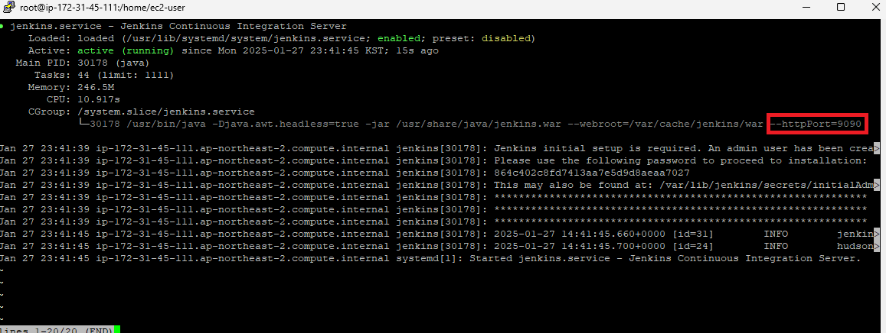

## 7. MySQL 설치 및 설정
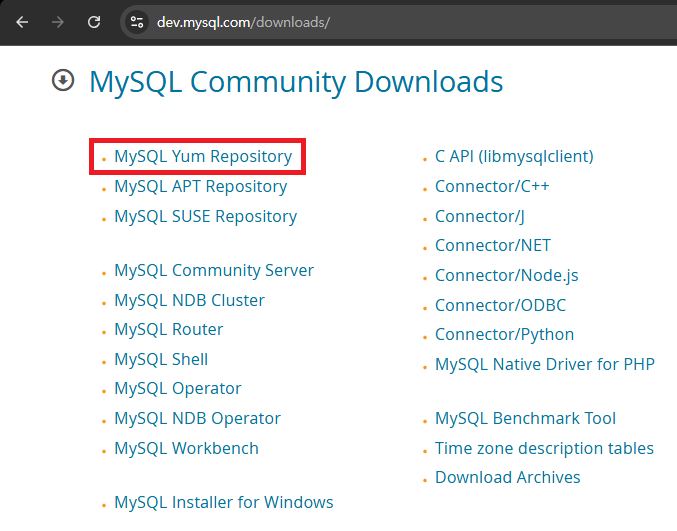

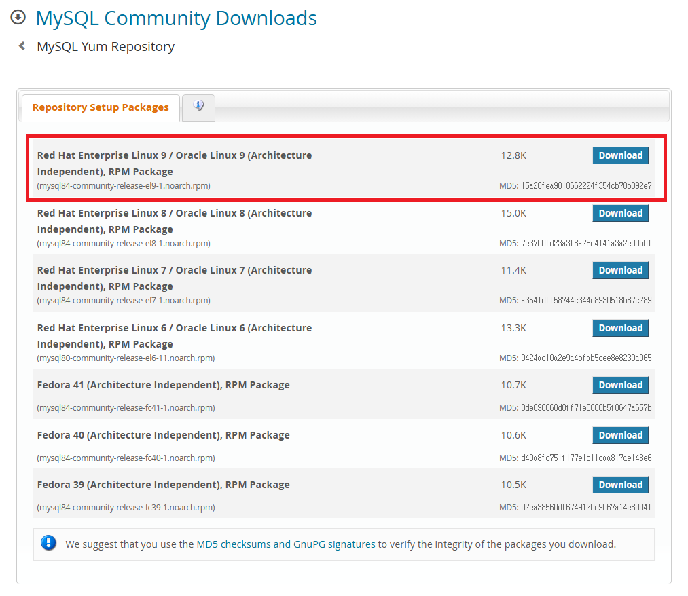

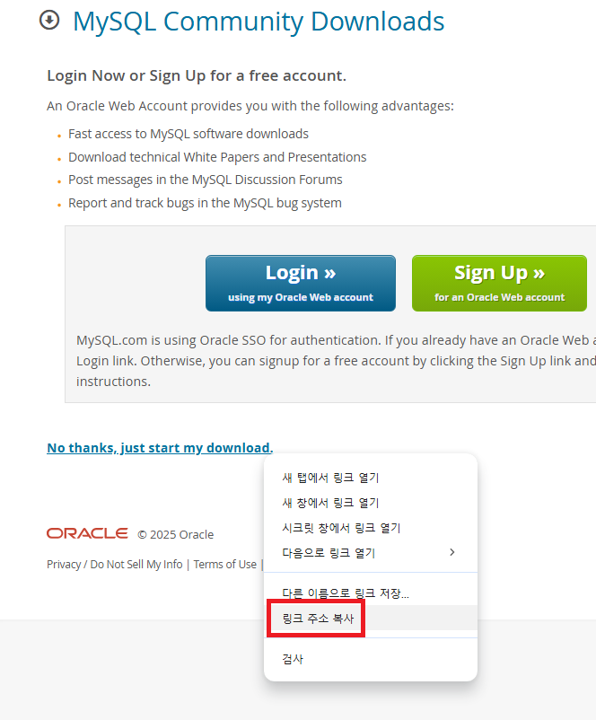

Shift + Insert를 누르면, 윈도우 환경에서 복사 한 내용이 Linux 환경에서 붙여넣기 됩니다.
```
# mysql yum repository 설치
sudo yum install -y https://dev.mysql.com/get/mysql84-community-release-el9-1.noarch.rpm

# mysql 서버 설치
sudo yum install -y mysql-server

# mysqld 실행 및 상태 확인
sudo systemctl restart mysqld // mysqld 재시작
sudo systemctl enable mysqld  // mysqld 활성화
sudo systemctl status mysqld  // mysqld 상태 확인
```

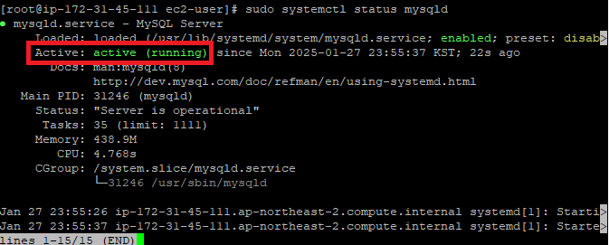

```
# 초기 패스워드 확인
sudo vi /var/log/mysqld.log
```

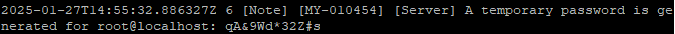

패스워드 입력 후 접속 
<br>
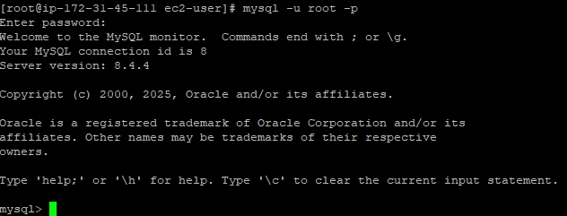

root 패스워드 설정 
<br>


DB 접속 계정 생성 
<br>
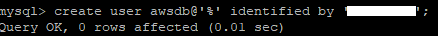


권한 부여 
<br>
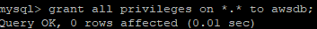

접속 테스트
<br>
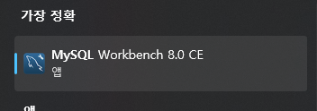

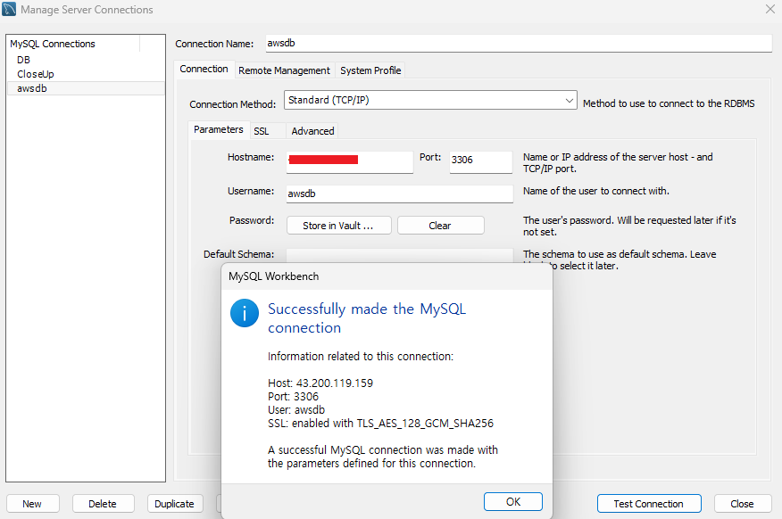