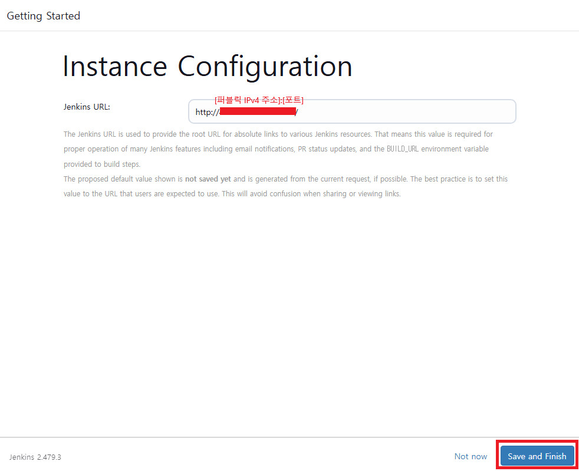
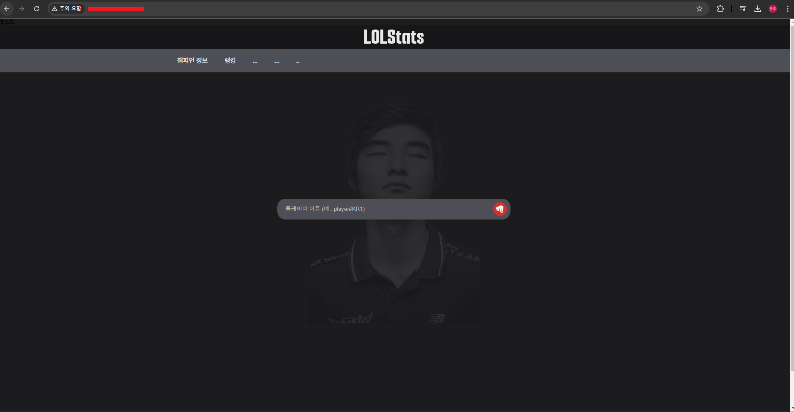

# Jenkins 설정

퍼블릭 IPv4:[설정한 포트] 로 주소 창 검색
<br>





> ## 빌드 실행 오프라인 오류 해결 방법 (해당하지 않는 경우 넘어가도 됩니다)
> 
> 
> 
> 
> 
> 
> 
> 
> 
> 
> 
> 
> 

> ## GitHub Token 발급
> GitHub -> Setting -> Developer settings(왼쪽 아래) -> Personal access tokens 해당 페이지에서 Generate new token을 클릭하면 아래와 같은 화면이 뜨게 됩니다.
> 
> 아래와 같이 설정 후, 토큰을 생성합니다.
> <br>
> 
> 
> 빨간 부분을 복사해서 저장해 둡니다.
> <br>
> 


Secret에 위에서 발급받은 token을 붙여넣기 해주고 다른 입력사항을 입력 후, Add를 눌러줍니다.
<br>


Test connection을 클릭 후, `Credentials verified for user 98Woonho, rate limit: 4999` 문구가 뜨면 성공입니다.
<br>


Available plugins에서 플러그인을 입력 후, 체크하여 설치를 진행해줍니다.
- `Github Integration`
- `Post Build Task`


본인의 main 혹은 master branch로 설정
<br>


아래 저장을 클릭 후, 지금 빌드 클릭
<br>


빌드가 성공적으로 되었고, 프로젝트가 생성된 것을 확인할 수 있습니다.
<br>


> ## Jenkins & Github CI/CD 구축
> 빌드 버튼을 누르지 않아도, 깃허브에 푸시되면 자동으로 빌드가 되도록 Jenkins와 GitHub 웹훅을 설정
> 
> 해당 프로젝트 -> Settings -> Webhooks 클릭 후 Add webhook 클릭
> <br>
> 
> 
> `Payload URL` : `http://[퍼블릭 Ipv4 주소]:[포트]/github-webhook/`
> <br>
> `Content Type` : `application/json`
> <br>
> 
> 
> 

Jenkins 프로젝트에서 구성을 클릭
<br>


저장 후, 빌드가 성공적으로 되었으면 깃허브에서 임의로 코드를 수정하여 push를 하면 정상적으로 build가 되는 것을 확인할 수 있습니다.

그리고 EC2 서버로 접속하여 `/var/lib/jenkins/workspace/[프로젝트 이름]/build/libs` 경로로 진입하면, 아래와 같은 *.jar파일이 생성된 것을 볼 수 있습니다.

<br>


다시 Dashboard -> 프로젝트 선택 -> 구성 으로 이동 후, 빌드 후 조치에서 *.jar 파일을 실행시킬 스크립트를 작성합니다.

<br>


> ## 스크립트
> ```
> JAR_NAME=LOLStats-0.0.1-SNAPSHOT.jar
> 
> if [ -z "`ps -eaf | grep $JAR_NAME | grep -v grep`" ]; then
>   echo "not found $JAR_NAME"
> else
>   ps -eaf | grep $JAR_NAME | grep -v grep | awk '{print $2}' |
>   while read PID
>   do
>     echo "Killing $PID ..."
>     sudo kill -9 $PID
>     echo "$PID is shutdown!"
>   done
> fi
> 
> nohup java \
>   -Dspring.datasource.url="jdbc:mysql://43.200.119.159:3306/lol_stats" \
>   -Dspring.datasource.username="awsdb" \
>   -Dspring.datasource.password="Woonho98" \
>   -Driot.api.key="RGAPI-542be7d3-5021-44f4-bb0f-93ded333f84b" \
>   -jar /var/lib/jenkins/workspace/LOLStats/build/libs/LOLStats-0.0.1-SNAPSHOT.jar &
> ```

저장 -> 지금 빌드 -> 빌드 성공 후에 `[퍼블릭 IPv4 주소]:8080` 으로 접속을 해보면, 내 웹사이트가 성공적으로 배포되는 것을 볼 수 있습니다.

<br>


> ## 빌드는 성공했는데, 서버가 배포되지 않는 경우
> 빌드는 성공했지만, 막상 접속을 하면 연결이 되어있지 않은 경우가 많을 것입니다. 이런 경우엔 아래와 같은 절차를 진행해보세요.
> 1. 스크립트 아래에 있는 `nohup java -jar /var/lib/jenkins/workspace/LOLStats/build/libs/LOLStats-0.0.1-SNAPSHOT.jar &` 코드를 복사
> 2. EC2 서버에 코드를 입력 후 실행
> 3. `cat nohup.out` 명령을 실행 후  *.jar 파일 실행 결과에서 어떠한 오류가 발생하였는지 확인 후 조치
> 
> 저 같은 경우는 이미 8080 포트를 사용중인 오류가 발생하였습니다. 이미 스크립트에서 현재 실행할려는 .jar의 PID를 찾아내서 kill 하는 작업을 설정해놓았지만, jenkins에서 `sudo` 명령어를 실행할 때 비밀번호를 요구하기 때문에 kill이 되지 않고 있었습니다. 그래서 비밀번호 없이 명령어가 실행되도록 아래와 같이 설정하였습니다.
> ```
> # sudoers 파일 편집
> sudo vi /etc/sudoers
>
> # 맨 아래 추가
> jenkins ALL=(ALL) NOPASSWD: /bin/kill
> ```
>
> 설정 후에 다시 jenkins를 build하면 성공적으로 springboot가 실행되는 것을 볼 수 있습니다.
